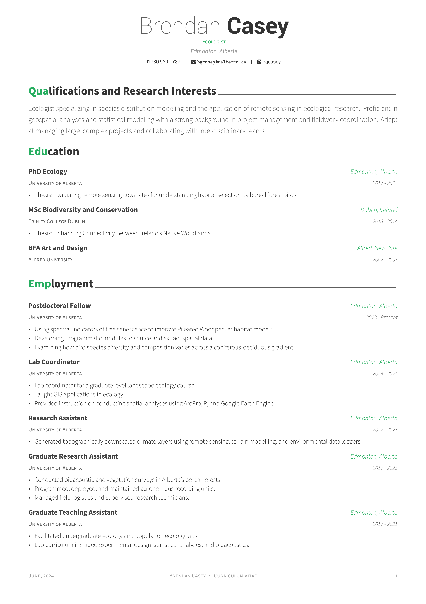
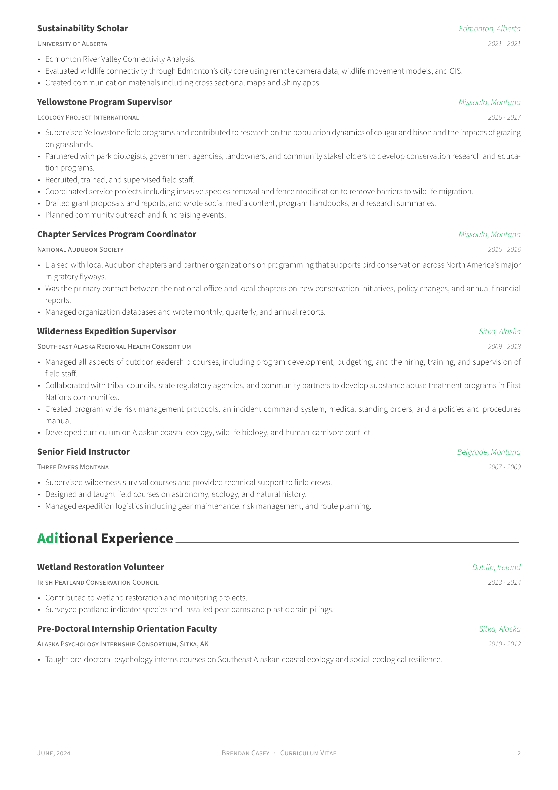
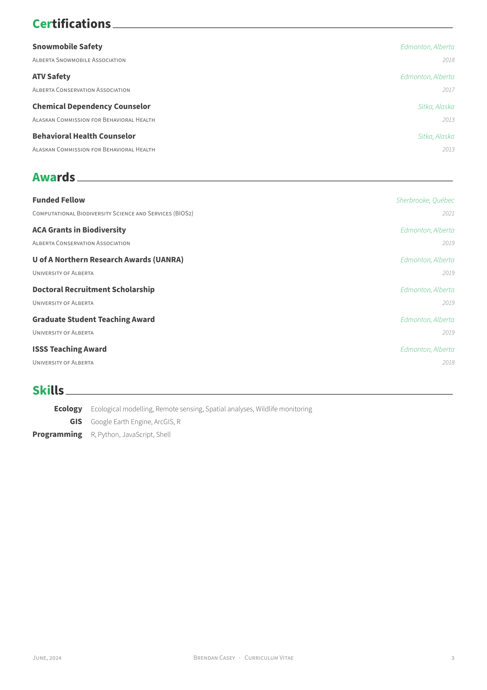

# CV and Cover Letter

<!-- badges: start -->

<!-- badges: end -->

Repository for generating a CV and cover letter using R Markdown, Vitae, Google Sheets, and the [Awesome-CV](https://github.com/posquit0/Awesome-CV) latex template. The CV is populated with data from a Google Sheet.

The code was adapted from:

- Mitchell O'Hara-Wild and Rob Hyndman. *vitae: Curriculum Vitae for R Markdown*. 2024. R package version 0.6.0. [https://github.com/mitchelloharawild/vitae](https://github.com/mitchelloharawild/vitae), [https://pkg.mitchelloharawild.com/vitae/](https://pkg.mitchelloharawild.com/vitae/).

---

